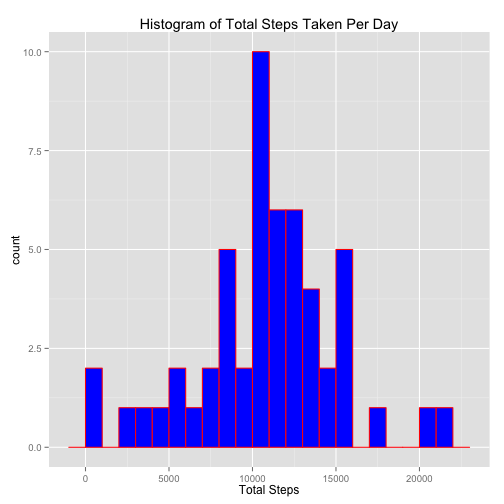
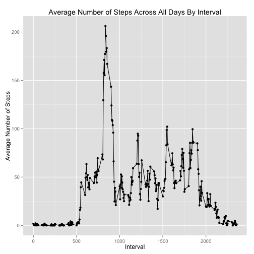
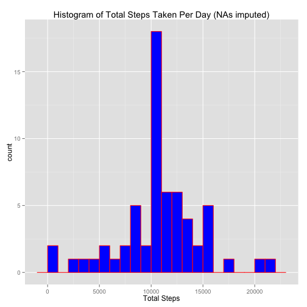
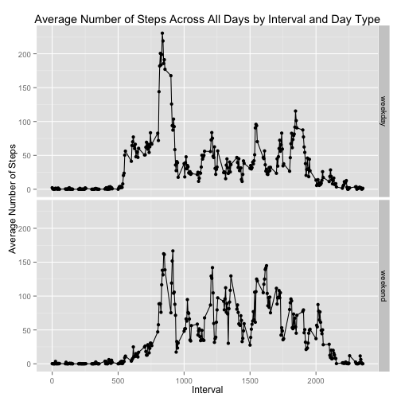

## Loading and preprocessing the data

```r
data <- read.csv("activity.csv", stringsAsFactors=F)
```

## What is mean total number of steps taken per day?

```r
# For this part of the assignment, you can ignore the missing values in the dataset.
dataNoNA <- data[complete.cases(data), ]

# 1. Calculate the total number of steps taken per day
aggSum <- aggregate(dataNoNA$steps, by=list(dataNoNA$date), FUN=sum)
names(aggSum) <- c("date", "sumSteps")

# 2. Make a histogram of the total number of steps taken each day
library(ggplot2)
print(qplot(aggSum$sumSteps, geom="histogram", 
            main="Histogram of Total Steps Taken Per Day",
            xlab="Total Steps", fill=I("blue"), col=I("red"), binwidth=1000))
```

 

```r
# 3. Calculate and report the mean and median of the total number of steps taken per day
mean <- mean(aggSum$sumSteps)
median <- median(aggSum$sumSteps)
```
* Mean total steps per day = 10766.19
* Median total steps per day = 10765

## What is the average daily activity pattern?


```r
# 1. Make a time series plot (i.e. type = "l") of the 5-minute interval (x-axis) and the
#    average number of steps taken, averaged across all days (y-axis)
aggAvg <- aggregate(dataNoNA$steps, by=list(dataNoNA$interval), FUN=mean);
names(aggAvg) <- c("interval", "avgSteps")
print(qplot(aggAvg$interval, y=aggAvg$avgSteps, type="l",
      main="Average Number of Steps Across All Days By Interval",
      xlab="Interval", ylab="Average Number of Steps") +
        geom_line(data=aggAvg, aes(x=interval, y=avgSteps)))
```

 

```r
# 2. Which 5-minute interval, on average across all the days in the dataset, contains the 
#    maximum number of steps?
maxRow <- aggAvg[aggAvg$avgSteps == max(aggAvg$avgSteps), ]
```
Interval 835 is the 5 minute interval with the maximum number of average daily steps (206.17).

## Imputing missing values

```r
# 1. Calculate and report the total number of missing values in the dataset (i.e. the
#    total number of rows with NAs)
missingCount <- sum(!complete.cases(data))
```
There are 2304 rows (13.1%) with missing values in the dataset. 


```r
# 2. Devise a strategy for filling in all of the missing values in the dataset. The
#    strategy does not need to be sophisticated. For example, you could use the 
#    mean/median for that day, or the mean for that 5-minute interval, etc.
uniqueDates <- unique(data$date)
uniqueDatesNoNA <- unique(dataNoNA$date)
noDataForDates <- uniqueDates[!(uniqueDates %in% uniqueDatesNoNA)]
```
Since data is completely missing for 8 dates (2012-10-01, 2012-10-08, 2012-11-01, 2012-11-04, 2012-11-09, 2012-11-10, 2012-11-14, 2012-11-30), we'll use the mean for the corresponding 5-minute interval to fill in missing values.


```r
# 3. Create a new dataset that is equal to the original dataset but with the missing 
#    data filled in.

# join data and avg data by interval
data_m <- merge(data, aggAvg, by="interval")
# preserve ordering by date and interval
data_m <- data_m[order(data_m$date, data_m$interval), ]
# create new column "filled" and populate it initially with data from steps column
data_m$filled <- data_m$steps
# overwrite the NA values in the filled column with the data from the avg steps col
missing <- which(is.na(data_m$steps))
data_m$filled[missing] <- data_m$avgSteps[missing]
# create new data frame with just steps (currently named "filled"), date and interval cols
imputedData <- data_m[, c("filled", "date", "interval")]
# rename "filled" col to "steps"
names(imputedData)[names(imputedData) == "filled"] <- "steps"

# 4. Make a histogram of the total number of steps taken each day and calculate and
#    report the mean and median total number of steps taken per day. Do these values
#    differ from the estimates from the first part of the assignment? What is the impact
#    of imputing missing data on the estimates of the total daily number of steps?
aggSumImputed <- aggregate(imputedData$steps, by=list(imputedData$date), FUN=sum)
names(aggSumImputed) <- c("date", "sumSteps")

print(qplot(aggSumImputed$sumSteps, geom="histogram", 
            main="Histogram of Total Steps Taken Per Day (NAs imputed)",
            xlab="Total Steps", fill=I("blue"), col=I("red"), binwidth=1000))
```

 

```r
meanImputed <- mean(aggSumImputed$sumSteps)
medianImputed <- median(aggSumImputed$sumSteps)
```
* Mean total steps per day (NAs imputed) = 10766.19, which is identical to the mean total steps per day with NAs omitted
* Median total steps per day (NAs imputed) = 10766.19. This value is equal to or "has converged" to the mean, because we've replaced an NA value in a time interval with the corresponding mean for that time interval.

## Are there differences in activity patterns between weekdays and weekends?

```r
# Use the dataset with the filled-in missing values for this part.

# 1. Create a new factor variable in the dataset with two levels – “weekday” and
#    “weekend” indicating whether a given date is a weekday or weekend day.

# convert character date field to native date field
imputedData$date <- as.Date(imputedData$date, "%Y-%m-%d")
# add "day type" weekday/weekend factor
library(chron)
imputedData$dayType <- factor(x=is.weekend(imputedData$date), 
                              labels=c("weekday", "weekend"))

# 2. Make a panel plot containing a time series plot (i.e. type = "l") of the 5-minute
#    interval (x-axis) and the average number of steps taken, averaged across all 
#    weekday days or weekend days (y-axis).

# aggregate by interval and day type
aggImputedAvg <- aggregate(imputedData$steps, 
                           by=list(imputedData$interval, imputedData$dayType), FUN=mean)
names(aggImputedAvg) <- c("interval", "dayType", "avgSteps")

print(qplot(interval, y=avgSteps, data=aggImputedAvg, type="l",
      main="Average Number of Steps Across All Days by Interval and Day Type",
      xlab="Interval", ylab="Average Number of Steps",
      facets=dayType ~ .,) +
        geom_line(data=aggImputedAvg, aes(x=interval, y=avgSteps)))
```

 

The two graphs - one for the average number of steps by weekday, the second for the weekend - are noticeably similar in shape. Differences include:

* The average number of steps tends to be higher on the weekday
* Activity (steps taken) starts earlier in the day on weekdays, compared to the weekend
